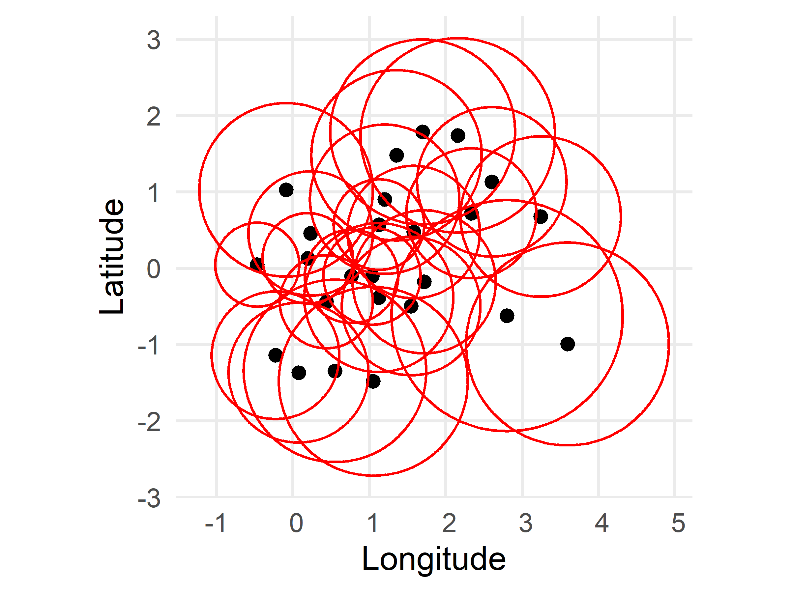
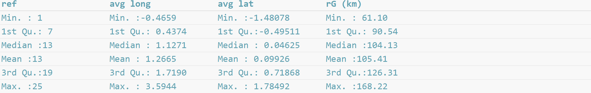
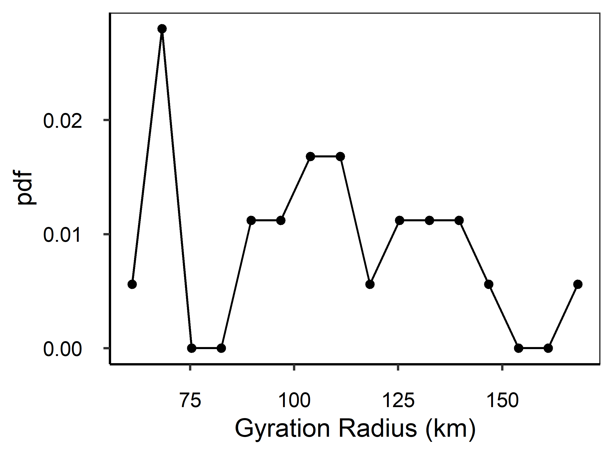
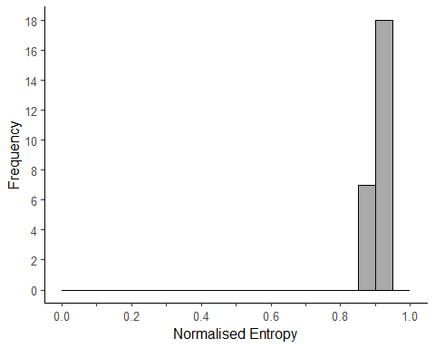
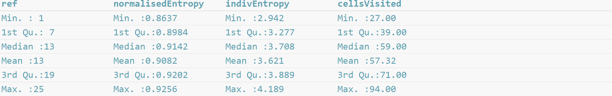
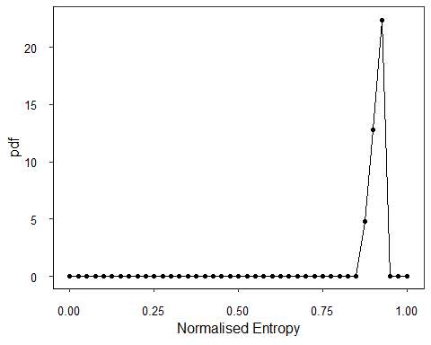
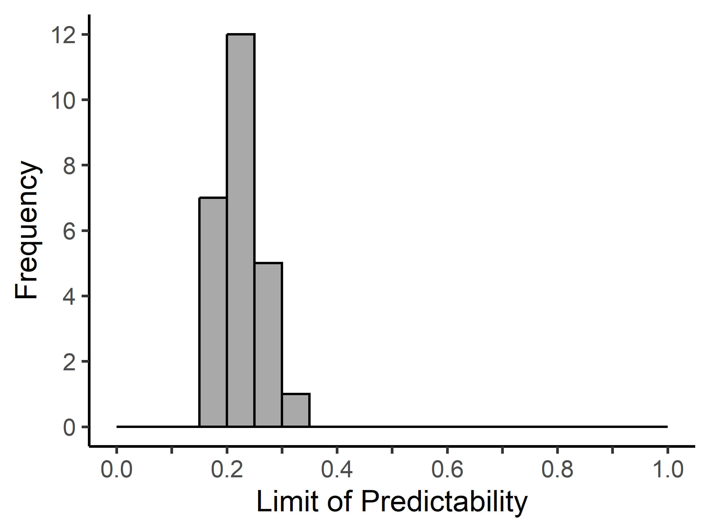
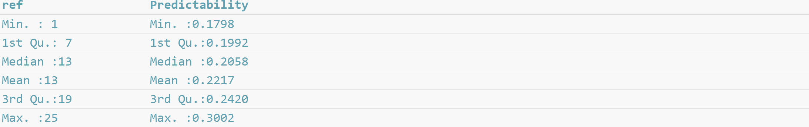
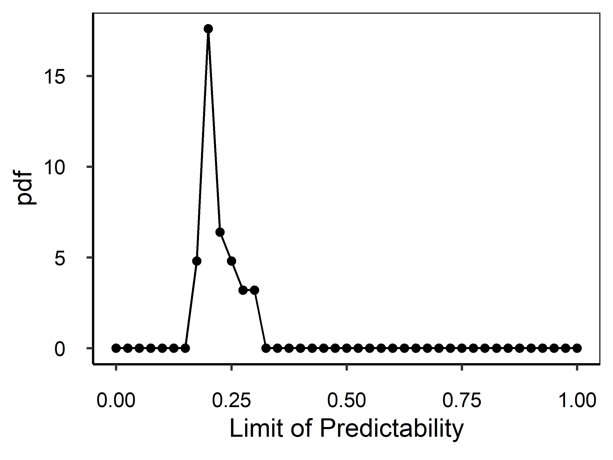

<style>
      img {
      border: 0;
    }
</style>

```{r setup, include=FALSE}
knitr::opts_chunk$set(dpi = 600, 
                      fig.align = 'center', 
                      fig.width = 4, 
                      fig.height = 4,
                      echo = TRUE,
                      collapse = TRUE,
                      comment = "#>") 
```


## Index

1. [Introduction and preparing the data](introduction.html)
2. [Movement patterns](movement_patterns.html)
3. [Space-use patterns](space_use_patterns.html)
4. [Intraspecific movements](intraspecific_movements.html)

## *Intraspecific movements*

PhysMove includes three metrics for quantifying intraspecific movement patterns that are based on four functions, including:

  * [Track dispersion](intraspecific_movements.html#track-dispersion): `GyrationRad()` and `PlotPDF()`
  * [Track entropy](intraspecific_movements.html#track-entropy): `Entropy()` and `PlotPDF()`
  * [Track predictability](intraspecific_movements.html#track-predictability): `Predictability()` and `PlotPDF()`

```{r load physmove intraspecific vignette, echo=FALSE}
# Load PhysMove
library(PhysMove)
```

## Track dispersion 

The `GyrationRad()` function calculates the dispersion (i.e., the gyration radius) of each track in a dataset (Figure V16).  

`GyrationRad()` requires a data frame with telemetry data (see [data formatting](introduction.html#data-formatting)) and includes two optional parameters:

* `map`: create a map (`map=TRUE`, by default), and
* `mapCol`: change the colour of the points, which indicate average track location,
and circles, which indicate how far each animal dispersed (`mapCol=c(“Black”, “Red”)`, by default).

`GyrationRad()` outputs a data frame of the results that were used to create the map, including: 

* *ref*: the reference id for each track,
* *avg long* and *avg lat*: the average longitude and latitude coordinates in degrees for each track, and 
* *rG* *(km)*: the gyration radius in kilometres for each track. 

```{r gyrad, eval=FALSE, echo=TRUE, message=FALSE}
# Calculate the dispersion of each track in the tracks dataset
GR <- GyrationRad(tracks)
```

```{r aspect ratio, eval=TRUE, echo=FALSE}
# First chunk to fetch the image size and calculate its aspect ratio
img <- magick::image_read("../vignettes/word_formatted/images/gyrad-1.png") # read the image using the magic library
img.asp <- magick::image_info(img)$height / magick::image_info(img)$width # calculate the figures aspect ratio
```

```{r gryad_load_fig, echo=FALSE, fig.asp=img.asp, out.width="60%"}

```

**Figure** **V16** Map illustrating dispersion patterns for `tracks` dataset using `GyrationRad()` default parameters. Black points represent the mean location of each track and red circles represent how far each track dispersed (i.e., each tracks' gyration radius).

```{r preview gyrad, echo=TRUE, eval=FALSE}
# Summarize gyration radius results
summary(GR)
```

```{r summary_gyrad_load_fig, echo=FALSE, fig.align='left', out.width='100%'}

```

### Probability density function of gyration radius results

A pdf of the results from `GyrationRad()` can be plotted with the `PlotPDF()` function when the `desc` parameter is set to “GyrationRad”
(Figure V17).

```{r gyrad pdf, eval=FALSE, echo=TRUE}
# Create a pdf plot of gyration radius values
pdf.gr <- PlotPDF((GR$`rG (km)`), desc="GyrationRad")
```

```{r aspect ratio2, eval=TRUE, echo=FALSE}
# First chunk to fetch the image size and calculate its aspect ratio
img <- magick::image_read("../vignettes/word_formatted/images/gyrad_pdf-1.png") # read the image using the magic library
img.asp <- magick::image_info(img)$height / magick::image_info(img)$width # calculate the figures aspect ratio
```

```{r gyrad_pdf_load_fig, echo=FALSE, fig.asp=img.asp, out.width="60%"}

```

**Figure** **V17** Probability density function (pdf) plot of gyration radius values for the `tracks` dataset determined with `GyrationRad()` default parameters. Plot created using `PlotPDF()` with `desc=“GyrationRad”`.

$~$
$~$

[Back to top](intraspecific_movements.html)

## Track entropy

The `Entropy()` function calculates track randomness based on the fraction of data points from each track within each grid cell (Figure V18). The resulting entropy scores are then normalised so results can be compared between individuals. 

`Entropy()` requires a data frame with telemetry data (see [data formatting](introduction.html#data-formatting)) and includes two optional parameters:

* `gridCell`: change grid cell size in degrees (`gridCell=0.25`, by default), and
* `histPlot`: output a histogram (`histPlot=TRUE`, by default).

`Entropy()` outputs results a data frame with in four columns, including: 

* *ref*: reference id for each track,
* *normalisedEntropy*: normalised entropy scores,
* *indivEntropy*: individual entropy scores (before normalisation), and 
* *cellsVisited*: number of cells visited by each track. 

```{r ent, echo=TRUE, eval=FALSE}
# Calculate track entropy using default parameters
Ent <- Entropy(tracks)
```

```{r aspect ratio3, eval=TRUE, echo=FALSE}
# First chunk to fetch the image size and calculate its aspect ratio
img <- magick::image_read("../vignettes/word_formatted/images/ent-1.png") # read the image using the magic library
img.asp <- magick::image_info(img)$height / magick::image_info(img)$width # calculate the figures aspect ratio
```

```{r ent_load_fig, echo=FALSE, fig.asp=img.asp, out.width="60%"}

```

**Figure** **S18** Histogram of normalised entropy scores for `tracks` dataset created using `Entropy()` default parameters.

```{r ent head, echo=TRUE, eval=FALSE}
# Summarise Entropy results
summary(Ent)
```

```{r summary_ent_load_fig, echo=FALSE, fig.align='left', out.width='100%'}

```

### Probability density function of Entropy results

A pdf of the results from `Entropy()` can be plotted with the `PlotPDF()` function when the `desc` parameter is set to “Entropy” (Figure V19)..

```{r ent pdf, echo=TRUE, eval=FALSE}
# Create a pdf plot of the entropy scores
pdf.ent <- PlotPDF(Ent$normalisedEntropy, "Entropy")
```

```{r aspect ratio4, eval=TRUE, echo=FALSE}
# First chunk to fetch the image size and calculate its aspect ratio
img <- magick::image_read("../vignettes/word_formatted/images/ent_pdf-1.png") # read the image using the magic library
img.asp <- magick::image_info(img)$height / magick::image_info(img)$width # calculate the figures aspect ratio
```

```{r ent_pdf_load_fig, echo=FALSE, fig.asp=img.asp, out.width="60%"}

```

**Figure** **V19** Probability density function (pdf) plot of normalised entropy scores for `tracks` dataset determined with `Entropy()` default parameters. Plot created using `PlotPDF()` with `desc=“Entropy”`.

$~$
$~$

[Back to top](intraspecific_movements.html)

## Track predictability 

The `Predictability()` function calculates the limit of predictability for each track based on their individual entropy scores (Figure V20;
Figure 1).  

`Predictability()` requires a data frame with telemetry data (see [data formatting](introduction.html#data-formatting)) and a data frame of results output from `Entropy()`, and includes two optional parameters:

* `startVal`: starting value used to find a root value for the limit of predictability equation (`startVal=0.99`, by default), and
* `histPlot`: output a histogram (`histPlot=TRUE`, by default).

`Predictability()` outputs a data frame of results with two columns, including: 

* *ref*: reference id for each track, and 
* *Predictability*:  predictability scores for each track. 

```{r predict, echo=TRUE, eval=FALSE}
# Track predictability using Predictability() default parameters and the output from Entropy()
Pred <- Predictability(tracks, Ent)
```

```{r aspect ratio5, eval=TRUE, echo=FALSE}
# First chunk to fetch the image size and calculate its aspect ratio
img <- magick::image_read("../vignettes/word_formatted/images/predict-1.png") # read the image using the magic library
img.asp <- magick::image_info(img)$height / magick::image_info(img)$width # calculate the figures aspect ratio
```

```{r predict_load_fig, echo=FALSE, fig.asp=img.asp, out.width="60%"}

```

**Figure** **V20** Histogram of predictability scores for `tracks` dataset determined using `Predictability()` default parameters and entropy scores from `Entropy()`.

```{r predict head, echo=TRUE, eval=FALSE}
# Summarize Predictability scores
summary(Pred)
```

```{r summary_predict_load_fig, echo=FALSE, fig.align='left', out.width='100%'}

```

### Probability density function of Predictability results

A pdf of the results from `Predictability()` can be plotted with the `PlotPDF()` function when the `desc` parameter is set to “Predictability” (Figure V21).

```{r predict pdf, echo=TRUE, eval=FALSE}
# Create a pdf plot of the predictability scores
pdf.pred <- PlotPDF(Pred$Predictability, desc="Predictability")
```

```{r aspect ratio6, eval=TRUE, echo=FALSE}
# First chunk to fetch the image size and calculate its aspect ratio
img <- magick::image_read("../vignettes/word_formatted/images/predict_pdf-1.png") # read the image using the magic library
img.asp <- magick::image_info(img)$height / magick::image_info(img)$width # calculate the figures aspect ratio
```

```{r predict_pdf_load_fig, echo=FALSE, fig.asp=img.asp, out.width="60%"}

```

**Figure** **V21** Probability density function (pdf) plot of predictability scores for `tracks` dataset determined with `Predictability()` default parameters and results from `Entropy()`. Plot created using `PlotPDF()` with `desc=“Predictability”`.

$~$
$~$

[Back to top](intraspecific_movements.html)

## References & Recommended resources

<div style="text-indent: -40px; padding-left: 40px;">

Burnham, K.P. & Anderson, D.R. (2004) Multimodel Inference: Understanding
  AIC and BIC in Model Selection. *Sociological Methods & Research*, 33,
  261-304.

Calich, H.J. *et al*. (2021) Comprehensive analytical approaches reveal
  species-specific search strategies in sympatric apex predatory sharks.
  *Ecography*, 44, 1544-1556.

Farage, C. *et al*. (2021) Identifying flow modules in ecological
  networks using Infomap. *Methods in Ecology and Evolution*, 12, 778–786.

Méndez, V., *et al*. (2013). Stochastic Foundations in Movement Ecology:
  Anomalous Diffusion, Front Propagation and Random Searches. Berlin,
  Heidelberg, Germany, Springer Berlin / Heidelberg.

Rodríguez, J.P. *et al*. (2017) Big data analyses reveal patterns and
  drivers of the movements of southern elephant seals. *Scientific*
  *Reports*, 7, 1-10.

Viswanathan, G. M., *et al*. (2011). The Physics of Foraging: An
  Introduction to Biological Encounters and Random Searches. Cambridge,
  Cambridge University Press.

Wickham, H. (2016) ggplot2: Elegant Graphics for Data Analysis.
  Springer-Verlag, New York.

</div>
