<style>
      img {
      border: 0;
      height: auto;
      display: block; 
      margin: 1em auto
    }
</style>

```{r setup, include=FALSE}
knitr::opts_chunk$set(dpi = 600, 
                      fig.align = 'center', 
                      fig.width = 4, 
                      fig.height = 4,
                      echo = TRUE,
                      collapse = TRUE,
                      comment = "#>") 
```


## Index

1. [Introduction and data preparation](pt1_introduction.html)
2. [Movement patterns](pt2_movement_patterns.html)
3. [Space-use patterns](pt3_space_use_patterns.html)
4. [Intraspecific movements](pt4_intraspecific_movements.html)

## *Movement patterns*

*PhysMove* includes 5 metrics for quantifying movement patterns that are based on ten functions, including:

  * [Scale of movement](pt2_movement_patterns.html#scale-of-movement): `rms()` 
  * [Movement patterns across temporal scales](pt2_movement_patterns.html#movement-patterns-across-temporal-scales): `calcDisp()` and `plotDispPDF()`
  * [Search patterns](pt2_movement_patterns.html#search-patterns): `fitDist()`, `compDist()`, and `plotDist()`
  * [Influence of correlations on movement decisions](pt2_movement_patterns.html#influence-of-correlations-on-movement-decisions): `randomise()` and `plotRandomTracks()`
  * [Turning angles](pt2_movement_patterns.html#turning-angles): `turningAngles()` and `plotAngles()`

```{r load physmove movement vignette, echo=FALSE}
# Load PhysMove
library(PhysMove)
```

## Scale of movement

The `rms()` function provides insights into the scale of movement by calculating mean and root-mean-square (RMS) displacements and plotting them over time (Figure V2).

`rms()` requires a data frame with telemetry data (see [data formatting](pt1_introduction.html#data-formatting)) and includes four optional parameters:

  * `timeUnit`: time unit used to calculate the time between locations (`timeUnit= “days”`, by default),
  * `wBins`: width of the time bins used to calculate how frequently displacements occurred
(`wBins=1.1`, by default),
  * `plot`: create a scatter plot (`plot=TRUE`, by default), and
  * `lm`: fit a linear model to examine the relationship between root-mean-square
  displacements and time (`lm=TRUE`, by default).

`rms()` results are output as a list. The first list element is a data frame of results with three columns:

  * *timeWindow*: binned time windows in whatever unit was set using `timeUnit`
  * *meanDisplacements*: mean displacement values in km that correspond with *timeWindow*
  * *rmsDisplacements*: root-mean-square displacement values that correspond with *timeWindow*

The second list element is a data frame of results from the linear model and is only exported when `lm=TRUE`. The slope of the linear model is used to describe the scale of movement.

Note that because `rms()` calculates all displacements in each track, this function can take time. Progress updates will appear when calculations are 25%, 50%, 75%, and 100% complete..

```{r calcualte rms, eval=FALSE}
# Calculate RMS values with default parameters
rms.result <- rms(tracks)
```

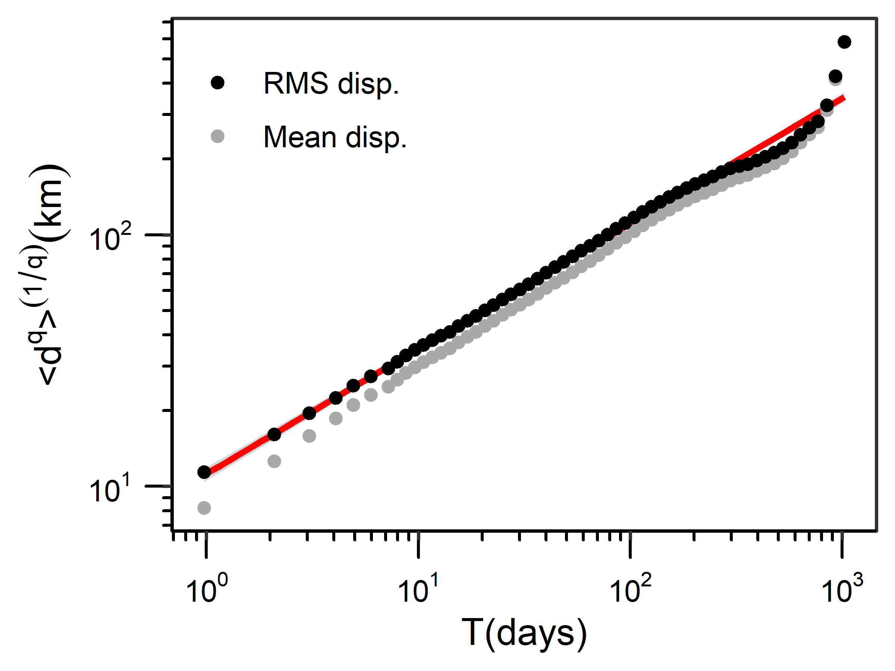

**Figure V2** Scatter plot of mean (grey points; q=1) and root-mean-square (RMS; black points; q=2) displacements (d) in kilometers (km) from tracks dataset over time (T) in days, fit to a linear model (red line with standard error shaded in grey). Plot created with `rms()` default parameters. 

```{r summarise rms results, eval=FALSE}
# Summarise RMS results
summary(rms.result[["rmsResults"]])
```

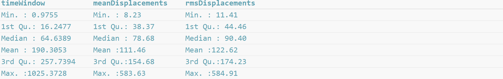

```{r calculate hurst exponent, eval=FALSE}
# Summarise linear model results and identify the Hurst exponent 
RMSlinearModel <- rms.result[["lm"]]
print(RMSlinearModel)
```

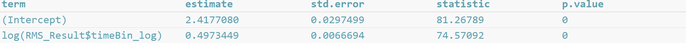

```{r hurst, eval=FALSE}
# Determine the Hurst exponent 
RMSlinearModel$estimate[2]
```

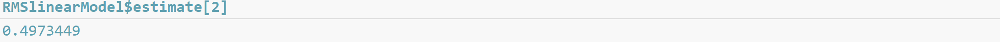

$~$
$~$

[Back to top](pt2_movement_patterns.html)

## Movement patterns across temporal scales

The `calcDisp()` function calculates displacements travelled in kilometres over set time windows.

`calcDisp()` requires a data frame with telemetry data (see [data formatting](pt1_introduction.html#data-formatting)) and has four optional parameters that allow you to change different aspects of the time windows:

  * `min_hr` and `max_hr`: set the minimum and maximum times between
  location estimates in hours, respectively (`min_hr=24` and `max_hr=240`, by default),
  * `interval_hr`: set the time interval in hours. This parameter creates a sequence of time windows
  between the minimum and maximum times over the set time interval (`interval_hr=24`, by default), and
  * `range_hr`: set the range in hours. This parameter allows the code to identify location estimates that are close to, but not exactly separated by the `interval_hr` input value (`range_hr=6`, by default).

For example, by default, `calcDisp()` calculates displacements between location estimates separated by 10 time windows: 24 ± 6 hours, 48 ± 6 hours, 72 ± 6 hours, etc., until 240 ± 6 hours.

`calcDisp()` outputs a list where each list element contains the displacements calculated over a time window, such that the first list element contains data from the first time window and so on. For example, by default, the first list element includes displacements calculated over 24 ± 6 hours, and the tenth list element includes displacements calculated over 240 ± 6 hours.

```{r calc disp, eval=FALSE}
# Calculate displacements with default parameters
disp.all <- calcDisp(tracks)

# "15598 displacements in 24 +/- 6 hour(s)"
# "15573 displacements in 48 +/- 6 hour(s)"
# "15548 displacements in 72 +/- 6 hour(s)"
# "15523 displacements in 96 +/- 6 hour(s)"
# "15498 displacements in 120 +/- 6 hour(s)"
# "15473 displacements in 144 +/- 6 hour(s)"
# "15448 displacements in 168 +/- 6 hour(s)"
# "15423 displacements in 192 +/- 6 hour(s)"
# "15398 displacements in 216 +/- 6 hour(s)"
# "15373 displacements in 240 +/- 6 hour(s)"
```

```{r sum disp from 1st time window, eval=FALSE}
# Summarise displacements calculated over the first time window (24 ± 6 hours)
summary(unlist(disp.all[[1]]))
```

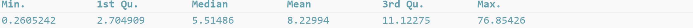


### Probability density function (pdf) of displacements

Probability density functions (pdfs) of displacements describe the probability distribution of the displacements and can be used to calculate the probability of displacements occurring (Figure V3 - Figure V4).

The `plotDispPDF()` function requires a list of displacements calculated using `calcDisp()` and includes 3 optional parameters:

  * `normalised`: normalise the data before plotting, which divides all displacements in a time window by the mean displacement for that time window (`normalised=TRUE`, by default).
  * `colours`: change the point colours (`colours=rainbow`, by default) and
  * `legend`: add or remove a legend (`legend=TRUE`, by default).
  
`plotDispPDF()` outputs a data frame of all data used to create the plot, including:

  * *pdf*: pdf values,
  * *disp*: binned displacement values (note that if `normalised=TRUE` the displacements are normalised values), and
  * *timeWindow*: corresponding time windows

```{r plot all norm disp, eval=FALSE}
# Create a probability density function (pdf) plot of normalized displacements
plot.data <- plotDispPDF(disp.all)
```

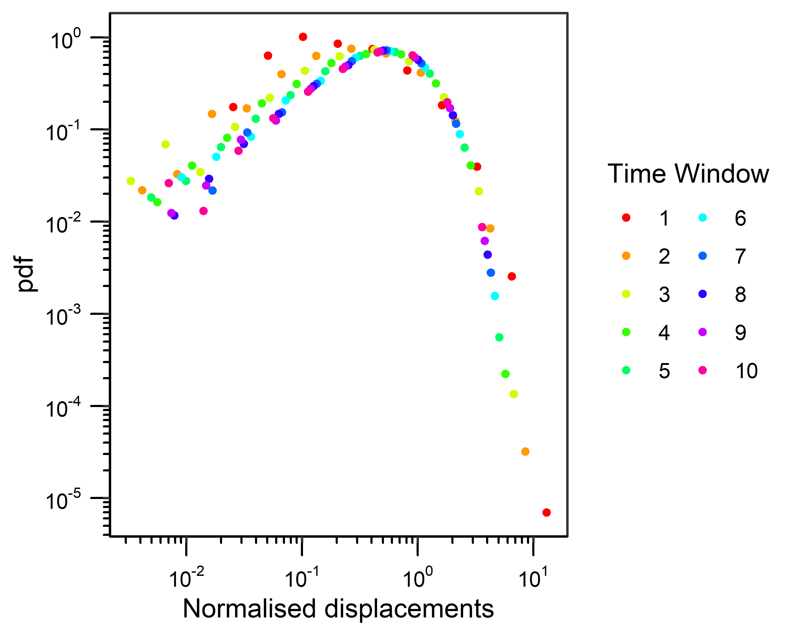

**Figure V3** Probability density function (pdf) plot of normalised displacements from the `tracks` dataset calculated over 10 time windows, 24 to 240 hours at 24 ± 6-hour time intervals with `calcDisp()`. Plot created with `plotDispPDF()` default parameters (i.e., where `normalised=TRUE`). 

```{r plot all disp (not norm), eval=FALSE}
# Create a probability density function (pdf) plot of raw (i.e., not normalized) displacements
plot.data.norm <- plotDispPDF(disp.all, normalised=FALSE)
```

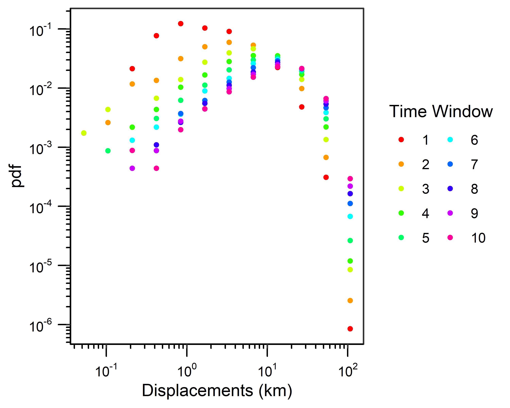

**Figure V4** Probability density function (pdf) plot of displacements from the `tracks` dataset calculated over 10 time windows, 24 to 240 hours at 24 ± 6-hour time intervals with `calcDisp()`. Plot created with `plotDispPDF()` where `normalised=FALSE`.

$~$
$~$

[Back to top](pt2_movement_patterns.html)

## Search patterns 

*PhysMove* can be used to identify the best-fit distribution of displacements, which can provide insights into the search pattern(s) a species may use to locate resources. Determining the best-fit distribution for the displacements involves 3 functions:

1. `fitDist()`:

Fits cdfs of continuous power-law, exponential, and lognormal distributions over the full range of displacements (i.e., full
distributions) or to displacements truncated by a minimum value (i.e., truncated distributions). The `fitDist()` function requires a list of displacements calculated using `calcDisp()` and includes four optional parameters:

  * `dist`: distributions you want to fit to the displacement data. `fitDist()` can fit continuous power-law (“pl”), exponential
    (“exp”), and lognormal (“lnorm”) distributions (`dist=c("pl","exp","lnorm")`, by default). To fit only one or two
    distributions simply remove the distribution(s) you are not interested in running, e.g., `dist=c("exp","lnorm")`.
  * `set_xmin`: To limit the fitted distribution to values above a specified value. If your data are going to be normalised this value will have to be a normalised value as well. Default is NULL.
  * `full`: determines if distributions are fit over the full range of displacement data (`full=TRUE`), or to displacements truncated by a minimum value (`full=FALSE`, by default)
  * `normalise`: normalise displacements before fitting distributions (`normalise=TRUE`, by default). Displacements
    should be normalised if they were calculated over multiple temporal periods.

`fitDist()` outputs a list including two list elements. The first list element is a data frame that includes:

  * *distribution*: all distributions fit to the displacement data (pl, exp, or lnorm),
  * *xmin*: minimum value used to fit each distribution
  * *parameter 1*: first parameter for each distribution (i.e., α, λ, or μ for pl, exp, and lnorm, respectively)
  * *parameter 2*: second distribution parameter (i.e., σ, only applicable to lnorm), and
  * *nTail*: number of values greater than or equal to xmin.
    
The second list element is a logical argument that records if the displacements were normalized (TRUE), or not (FALSE). This information is required for `plotDist()` and `compDist()`.

2. `plotDist()`:

Uses the results from `fitDist()` to plot ccdfs of the displacements with fit lines for each distribution. The `plotDist()` function requires a list of displacements calculated using `calcDisp()`, results from `fitDist()`, and includes five optional parameters:

  * `fitLines`: add fit lines for each distribution (`fitLines=TRUE`, by default),
  * `setDist`: plot only specific distributions (`setDist=NULL`, by default, which will plot all distributions),
  * `colours`: change the colours of the fit lines (`colours=c("red","gold2","blue")`, by default), 
  * `legend`: add a legend (`legend=TRUE`, by default), and
  * `label`: X axis label. Note that "Normalised" will automatically be added if distributions were fit to normalised data. Default is NULL and will result in x-axis label of "input data".
    
`plotDist()` outputs a plot and a data frame of the displacements (x values) and ccdf values (y values) used in the plot.

3. `compDist()`:

Compares distribution fits from `fitDist()` and identifies the best-fit distribution for the displacements. Note that
`compDist()` can only be used when all distributions are fit to the same range of data (e.g., when `full=TRUE` or if `set_xmin≠NULL`). See Figure V5 for a methods overview. The `compDist()` function requires a list of displacements calculated using `calcDisp()`, the results from `fitDist()`, and includes one optional parameter:

  * `force_AICc`: force `compDist()` to calculate an AICc (`force_AICc=FALSE`, by default). By default, `compDist()` compares distribution fits using weighted AICc scores (AIC scores corrected for small sample sizes) when the sample size of the displacements used to fit the model (i.e., *nTail*) divided by the number of parameters in the model is less than or equal to 40; else, weighed AIC scores are calculated, following Burnham and Anderson (2004). `force_AICc` is used to calculate an AICc instead of an AIC score (if `force_AICc` = TRUE). The highest wAIC or wAICc score from each comparison indicates the best-fit distribution.

`compDist()` outputs a data frame that contains the summary statistics for each distribution fit (as described for `fitDist()`) with the corresponding *AICc*/*AIC* scores and weighted AICc/AIC scores (*wAICc*/*wAIC*). The distribution with the highest *wAIC* or *wAICc* score from each comparison is the best-fit distribution.

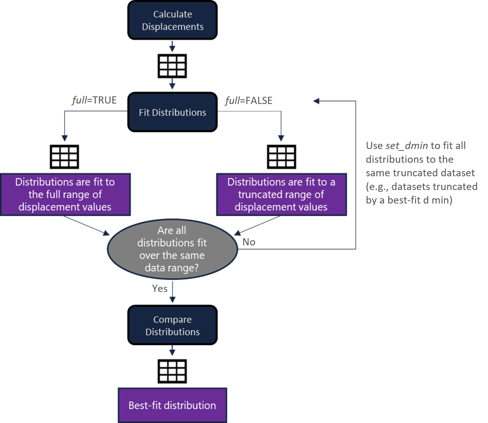

**Figure V5** Diagram outlining the procedure for identifying the best-fit distribution of displacements.

### Search patterns example

In the example below we calculate displacements over 24 ± 6 hours (to reduce processing times), plot a pdf of the displacement, identify the best-fit distribution for the full range of displacements, and we identify the best-fit distribution when displacement datasets are truncated by a best-fit xmin. In general, we recommend fitting distributions to both full and truncated datasets to gain a comprehensive understanding of displacement patterns.

We begin by calculating displacements over 24 ± 6 hours with `calcDisp()` and plotting a pdf of the displacements with `plotDispPDF()` (Figure V6). 

```{r calc disp over 24 hours, eval=FALSE}
# Calculate displacements over 24 ± 6 hours
disp <- calcDisp(tracks, max_hr=24)

# "15598 displacements in 24 +/- 6 hour(s)"
```

```{r summarise disp, eval=FALSE}
# Summarise displacements
summary(unlist(disp))
```


```{r plot 24 hr disp, eval=FALSE}
# Plot displacements (as displacements were only calculated over one time window they do not need to be normalised)
plot.data.pdf <- plotDispPDF(disp, normalised=FALSE)
```

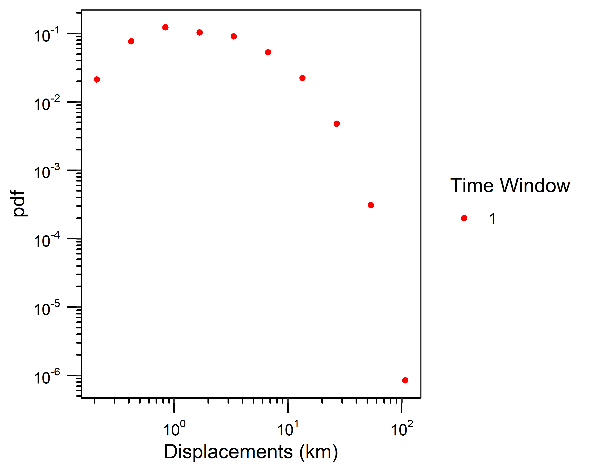

**Figure V6** Probability density function (pdf) plot of displacements calculated using `calcDisp()` with `max_hr=24`. Plot created with `plotDispPDF()` and `normalised=FALSE`.

#### Fitting full distributions

We use `fitDist()` to fit the full range of distributions calculated over 24 ± 6 hours to power-law, exponential, and lognormal distributions, and `plotDist()` to visualise the results (Figure V7).

```{r fit full dist, eval=FALSE}
# Fit all distributions to the full range of displacement data 
distResults <- fitDist(disp, full=TRUE, normalise=FALSE) 
distResults[["distResults"]]
```

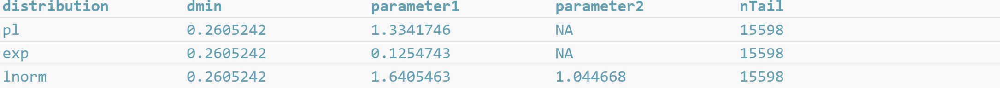

```{r plot full dist, eval=FALSE}
# Create a ccdf plot of displacements with fit lines illustrating distributions fit to the full range of displacements
plot.data.all.pdf <- plotDist(disp, distResults)
```

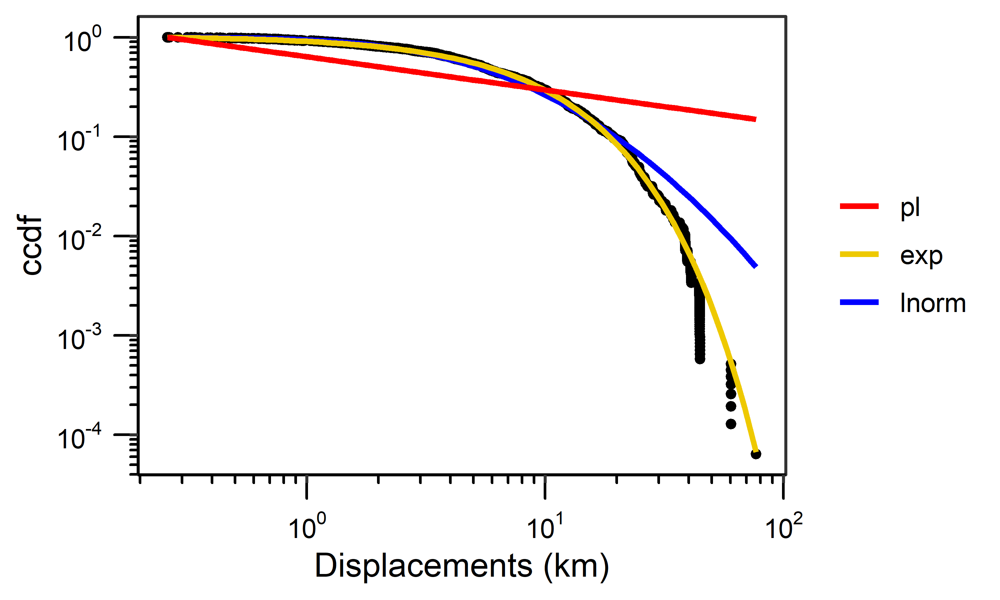

**Figure V7** Complementary cumulative distribution function (ccdf) of displacements (calculated using `calcDisp()` with `max_hr=24`). Plot includes fit lines for power-law (pl), exponential (exp), and lognormal (lnorm) distributions based on results from `fitDist()` with `full=TRUE`. Plot created using `plotDist()` default parameters. 

Next, we use `compDist()` to compare distribution fits over the full range of displacement data.

```{r comp dist fits, eval=FALSE}
# Identify the best-fit distribution for the full range of displacement data
compResults <- compDist(disp, distResults)
compResults
```

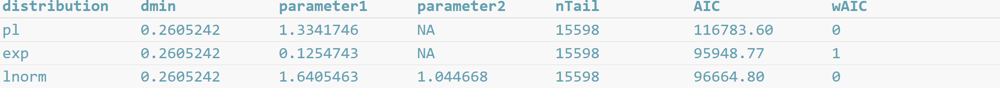


#### Fitting truncated distributions

We use `fitDist()` to identify the best-fit xmin for each distribution and fit truncated power-law, exponential, and lognormal distributions to displacements calculated over 24 ± 6 hours. We visualise results with `plotDist()` (Figure V8).

```{r find best-fit xmin for each dist, eval=FALSE}
# Fit all distributions and identify the best-fit xmin for each distribution
distResults.trunc <- fitDist(disp, full=FALSE, normalise=FALSE)
print(distResults.trunc[["distResults"]])
```

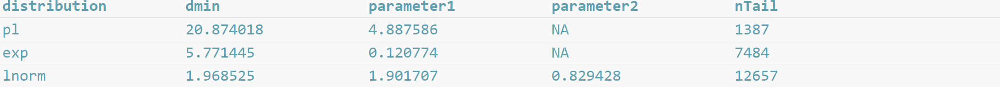


```{r plot trunc dist, eval=FALSE}
# Create a ccdf plot of displacements with fit lines illustrating distributions
# fit to the best-fit xmin for each distribution
plot.data.all.trunc <- plotDist(disp, distResults.trunc)
```

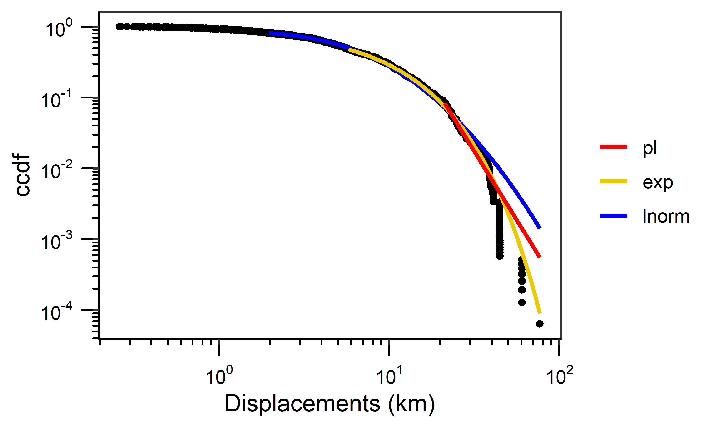

**Figure** **V8** Complementary cumulative distribution function (ccdf) of displacements calculated using `calcDisp()` with `max_hr=24` including fit lines for truncated power-law (pl), exponential (exp), and lognormal (lnorm) distributions based on the best-fit xmin results from `fitDist()`. Plot created using `plotDist()` default parameters.

Since each distribution was fit to a different range of data (i.e., *nTail* values are different for each distribution), we cannot run `compDist()` directly. Instead, we must make pairwise comparisons where `fitDist()` is re-run three times (once for each of the three distributions) where the `set_xmin` parameter is set to each of the best-fit xmin values in turn. 

```{r fit dist with pl, eval=FALSE}
# Fit all distributions using the xmin value for the power-law distribution
xmin <- distResults.trunc[["distResults"]][1,2]
distResultsPl <- fitDist(disp, set_xmin=xmin, normalise=FALSE)
```

```{r fit dist with exp, eval=FALSE}
# Fit all distributions using the xmin value for the exponential distribution
xmin <- distResults.trunc[["distResults"]][2,2]
distResultsExp <- fitDist(disp, set_xmin=xmin, normalise=FALSE)
```

```{r fit dist with lnorm, eval=FALSE}
# Fit all distributions using the xmin value for the lognormal distribution
xmin <- distResults.trunc[["distResults"]][3,2]
distResultsLnorm <- fitDist(disp, set_xmin=xmin, normalise=FALSE)
```
Once all distributions are fit using each of the best-fit xmin values, the distribution fits can be compared using `compDist()`. An important consideration for interpreting the `compDist()` results from pairwise comparisons is that if an xmin was set to favour a specific distribution, but the *wAIC*/*wAICc* scores do not identify that distribution as the best fit, the distribution corresponding to the xmin value is not the best-fit distribution for the displacements. For example, in the first pairwise comparison the xmin was set to the best-fit xmin for a power-law (20.87); however, as you'll see below, the *wAIC* scores identified an exponential distribution as the best fit. Therefore, we conclude that a power-law is not the best-fit distribution for the data. 

```{r comp pl, eval=FALSE}
# Compare distribution fits based on the best-fit xmin value for the power-law distribution
compResultsPl <- compDist(disp, distResultsPl)
compResultsPl
```

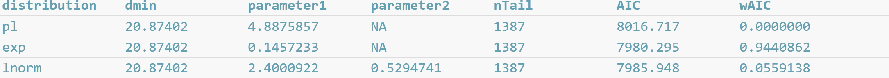

```{r comp exp, eval=FALSE}
# Compare distribution fits based on the best-fit xmin value for the exponential distribution
compResultsExp <- compDist(disp, distResultsExp)
compResultsExp
```

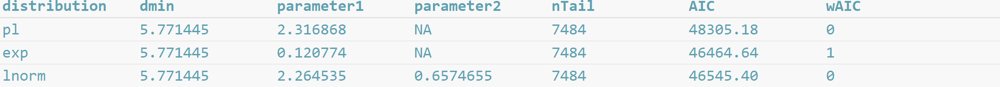

```{r comp lnorm, eval=FALSE}
# Compare distribution fits based on the best-fit xmin value for the lognormal distribution
compResultsLnorm <- compDist(disp, distResultsLnorm)
compResultsLnorm
```

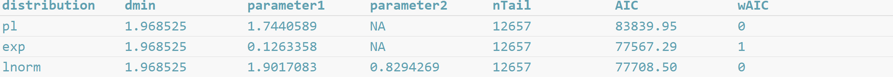

Overall conclusion: The data were best-fit to both full and truncated exponential distributions, when compared with power-law and lognormal distributions. Because the full distribution includes all of the data we will refer to the full distribution when presenting and discussing our final results.

$~$
$~$

[Back to top](pt2_movement_patterns.html)

## Influence of correlations on movement decisions 

The `randomise()` function can be used to gain insights into how correlations influenced a species' movements and space-use (Figure V9). 

`randomise()` requires a data frame with telemetry data (see [data formatting](pt1_introduction.html#data-formatting)) and includes four optional parameters:

* `randTrack`: change the number of randomised tracks that are created (`randTrack=100`, by default),
* `gridCell`: change the grid cell size in degrees (`gridCell=0.25`, by default),
* `plot`: create a scatter plot of the results (`plot=TRUE`, by default), and
* `lm`: fit a linear model to the average number of grid cells visited by the
randomised tracks and the number of grid cells visited by the original tracks (`lm=TRUE`, by default). The slope of this model can be used to discuss how correlations may have influenced our perception of movement.

`randomise()` outputs a list with three list elements. The first list element is a data frame with three columns:

* *ref*: the reference id numbers for each track,
* *CellsInOriginalTracks*: the number of grid cells visited by the original tracks, and
* *AvgCellsInRandomisedTracks*: the average number of grid cells visited by the randomised tracks.

The second and third list elements contain the randomised longitude and latitude values in list elements 2 and 3, respectively, which are needed for the `plotRandomTracks()` function

```{r randomise tracks, eval=FALSE}
# randomise() involves random number selection, so setting a seed enables the replication of results
set.seed(1)
# Randomise tracks from the tracks dataset with default parameters
randomise.result <- randomise(tracks)
```

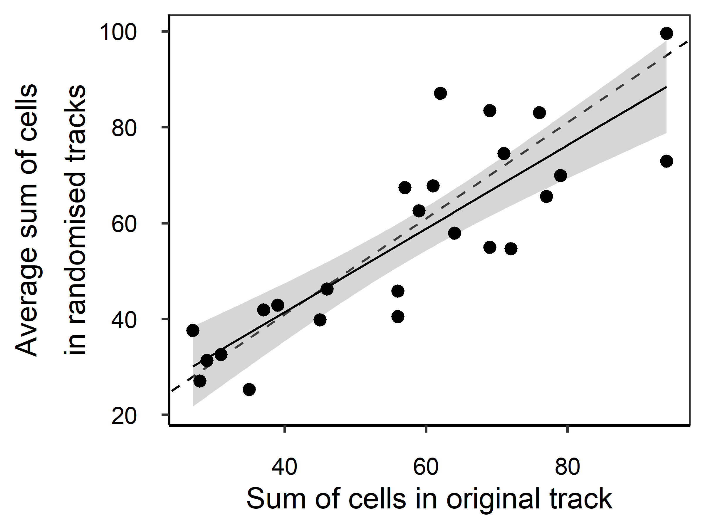

**Figure** **V9** Scatter plot illustrating the relationship between the number of grid cells visited by the original tracks from the `tracks` dataset and the average number of grid cells visited by the randomised tracks. The solid black line represents the linear model fit to this data, the grey shaded area reflects the standard error of the fit, and the dashed black line represents a 1:1 relationship. Plot created with `randomise()` default parameters.

```{r view random results, eval=FALSE}
# Summarise RMS results
summary(randomise.result[["resultsDF"]])
```

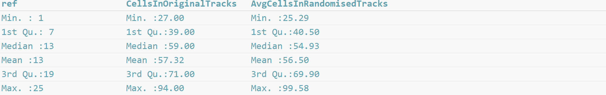

```{r lm of randomised results, echo=TRUE, eval=FALSE}
# Determine the slope of the linear model
RandomiselinearModel <- randomise.result[["lm"]]
print(RandomiselinearModel)
```

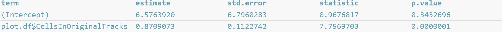

```{r slope of randomised results, echo=TRUE, eval=FALSE}
# Determine the slope without displaying the full linear model summary
RandomiselinearModel$estimate[2]
```

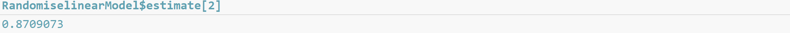

### Plot randomised tracks

To visualise the tracks created with `randomise()` you can use `plotRandomTracks()` (Figure V10).

`plotRandomTracks()` requires three parameters:

1. data frame with telemetry data (see [data formatting](pt1_introduction.html#data-formatting)),
2. reference id of the track you want to map (ref must be included in the telemetry data frame), and
3. results from `randomise()`.

`plotRandomTracks()` also includes 6 optional parameters:

* `numPlot`: the number of randomised tracks to plot (`numPlot=1:5`, by default, which will plot the first 5 randomised versions of each track),
* `colours`: the colours of the original and randomised location estimates, respectively (`colours=c(“black”,“grey70”)`, by default),
* `tracks`: connect points with lines (`tracks=TRUE`, by default),
* `startCol` and `endCol`: change the colours of the starting and ending points of each track, respectively (`startCol=“red”` and `endCol = “blue”`, by default), and
* `legend`: add a legend (`legend=TRUE`, by default).

`plotRandomTracks()` outputs the data used to create the map in three columns:

* *randTrack*: id number of the random track,
* *lon*: longitude coordinates of the randomised tracks, and
* *lat*: latitude coordinates of the randomised tracks.

```{r plot random tracks, eval=FALSE}
# Plot random tracks for tracks dataset reference id 1
plot.data.random.tracks <- plotRandomTracks(tracks, ref=1, randomise.result)
```

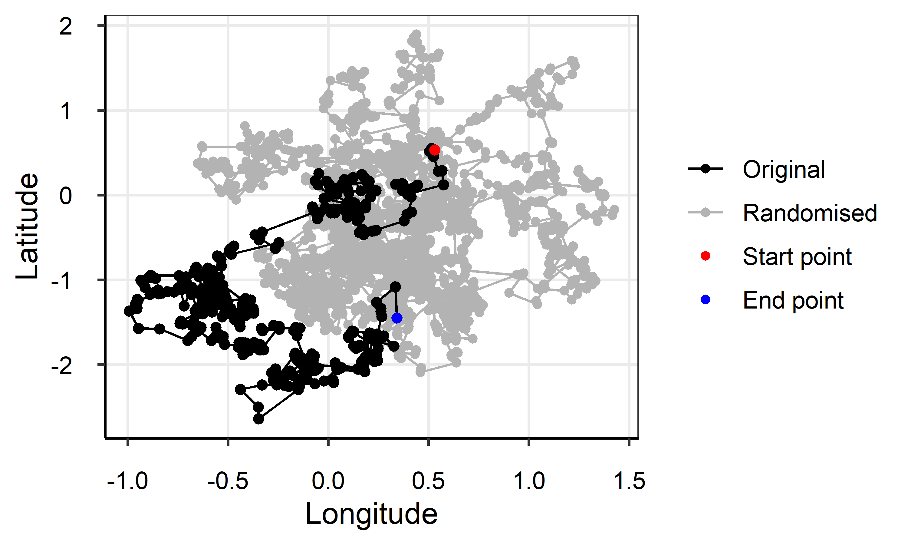

**Figure V10** Map illustrating the original track for reference id 1 from the tracks dataset (black points and line) and the first 5 randomised tracks for track reference id 1 calculated using `randomise()` (grey points and lines). The starting and ending locations are in red and blue, respectively. Plot created with `plotRandomTracks()` default parameters and `ref=1`.

$~$
$~$

[Back to top](pt2_movement_patterns.html)

## Turning angles

The `turningAngles()` function calculates turning angles between sets of three consecutive location estimates separated by set time windows to describe how species explore their habitats (Figure V11).

`turningAngles()` requires a data frame with telemetry data (see [data formatting](pt1_introduction.html#data-formatting)) and includes 5 optional parameters:

* `min_hr` and `max_hr`: set the minimum and maximum times between
location estimates in hours (`min_hr=24` and `max_hr=240`, by default),
* `interval_hr`: set the time interval in hours, which creates a sequence of time windows
between the minimum and maximum times over a set time interval (`interval_hr=24`, by default),
* `range_hr`: set the range in hours, which allows the code to identify location estimates that are
close to, but not exactly separated by the `interval_hr` input value (`range_hr=6`, by
default), and
* `histPlot`: output a histogram and control if “all” time windows are plotted or if only a specific time window is plotted, in which case "all" is replaced with a number corresponding to the desired time window, e.g., `histPlot=c(TRUE,1)` will plot the first time window (`histPlot=c(TRUE,“all”)`, by default).

Results are output in a list where each list element contains the angles calculated over a time window, such that the first list element contains data from the first time window and so on.

```{r calc turn angles, eval=FALSE}
# Calculate turning angles in the tracks dataset using default parameters
angle.results <- turningAngles(tracks)

# "15573 angles in 24 +/- 6 hour(s)"
# "15523 angles in 48 +/- 6 hour(s)"
# "15473 angles in 72 +/- 6 hour(s)"
# "15423 angles in 96 +/- 6 hour(s)"
# "15373 angles in 120 +/- 6 hour(s)"
# "15323 angles in 144 +/- 6 hour(s)"
# "15273 angles in 168 +/- 6 hour(s)"
# "15223 angles in 192 +/- 6 hour(s)"
# "15173 angles in 216 +/- 6 hour(s)"
# "15123 angles in 240 +/- 6 hour(s)"
```

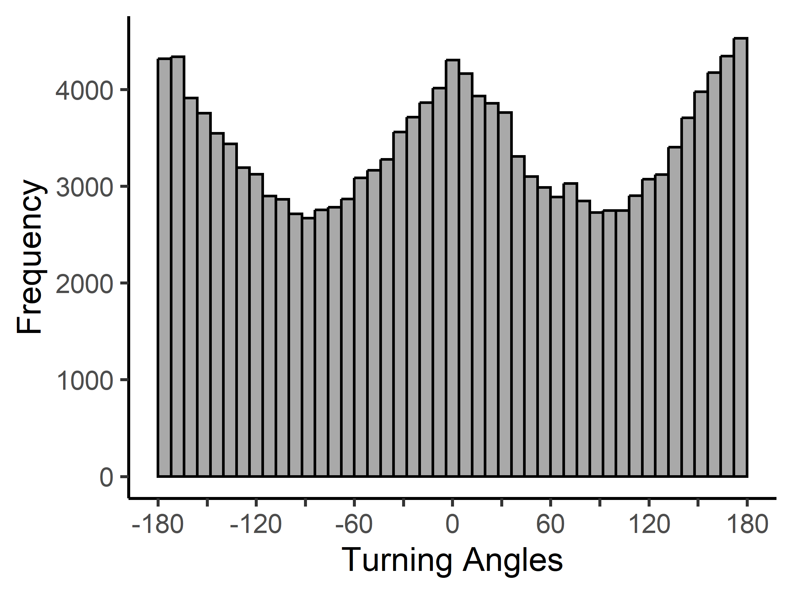

**Figure** **V11** Histogram of turning angles from the `tracks` dataset over ten time windows (24 to 240 hours at 24 ± 6 hour intervals). Plot created with `turningAngles()` default parameters.

```{r summarise turning angles, eval=FALSE}
# Summarise turning angles calculated over the first time window 
summary(angle.results[[1]])
```

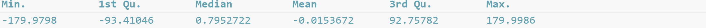


### Create a circle plot

Results from `turningAngles()` can be visualised with the `plotAngles()`
function, which creates a circle plot (also known as a spider or radar
plot) showing the frequency of turning angles over each time window
(Figure V12).

`plotAngles()` requires the list of angles output from `turningAngles()` and includes 3 optional parameters:

* `timePlot`: control if “all” time windows or only specific windows are plotted
(`timePlot=“all”`, by default),
* `colours`: change line colours (`colours=rainbow`, by default), and
* `legend`: add a legend (`legend=TRUE`, by default).

`plotAngles()` outputs a data frame of all data used to create the circle plot, including:

* *timeWindows*: the time windows
* *frequency*: turning angle frequency, and
* *angle*: turning angles in degrees

```{r plot angles with a circle plot, eval=FALSE}
# Plot angles with a circle plot
plot.data.angles <- plotAngles(angle.results)
```

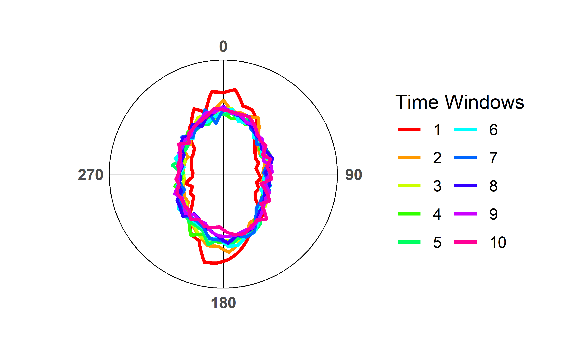

**Figure** **S12** Circle plot of turning angles recorded from the `tracks` dataset during ten time windows (24 to 240 hours at 24 ± 6 hour intervals). Plot created with `plotAngles()` default parameters.

$~$
$~$

[Proceed to Space-Use Patterns](pt3_space_use_patterns.html)

[Back to top](pt2_movement_patterns.html)


## References & Recommended resources
<div style="text-indent: -40px; padding-left: 40px;">

Burnham, K.P. & Anderson, D.R. (2004) Multimodel Inference: Understanding
  AIC and BIC in Model Selection. *Sociological Methods & Research*, 33,
  261-304.

Calich, H.J. *et al*. (2021) Comprehensive analytical approaches reveal
  species-specific search strategies in sympatric apex predatory sharks.
  *Ecography*, 44, 1544-1556.

Farage, C. *et al*. (2021) Identifying flow modules in ecological
  networks using Infomap. *Methods in Ecology and Evolution*, 12, 778–786.

Méndez, V., *et al*. (2013). Stochastic Foundations in Movement Ecology:
  Anomalous Diffusion, Front Propagation and Random Searches. Berlin,
  Heidelberg, Germany, Springer Berlin / Heidelberg.

Rodríguez, J.P. *et al*. (2017) Big data analyses reveal patterns and
  drivers of the movements of southern elephant seals. *Scientific*
  *Reports*, 7, 1-10.

Viswanathan, G. M., *et al*. (2011). The Physics of Foraging: An
  Introduction to Biological Encounters and Random Searches. Cambridge,
  Cambridge University Press.

Wickham, H. (2016) ggplot2: Elegant Graphics for Data Analysis.
  Springer-Verlag, New York.

</div>
