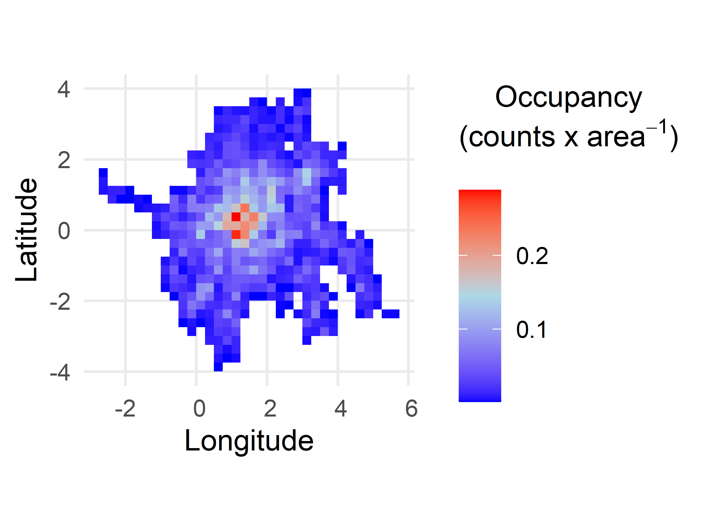
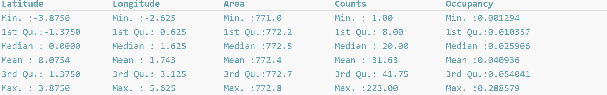
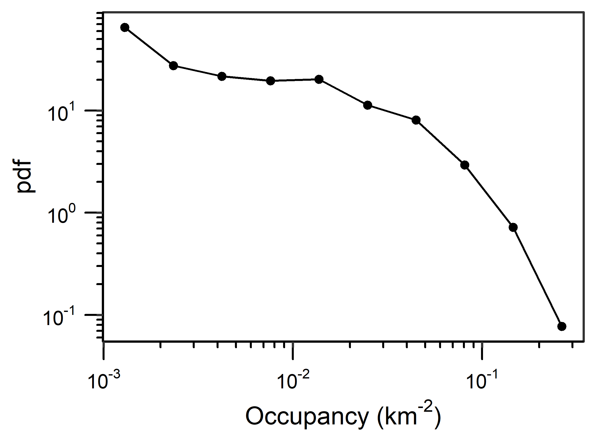
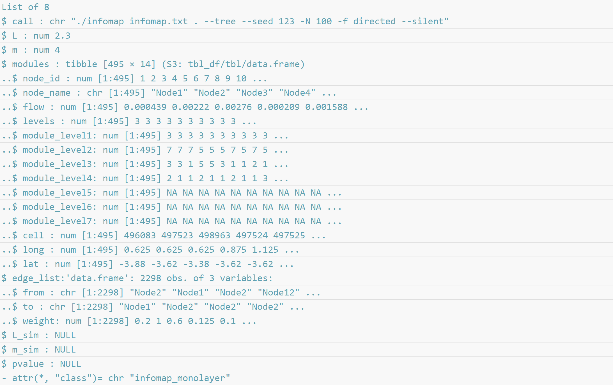
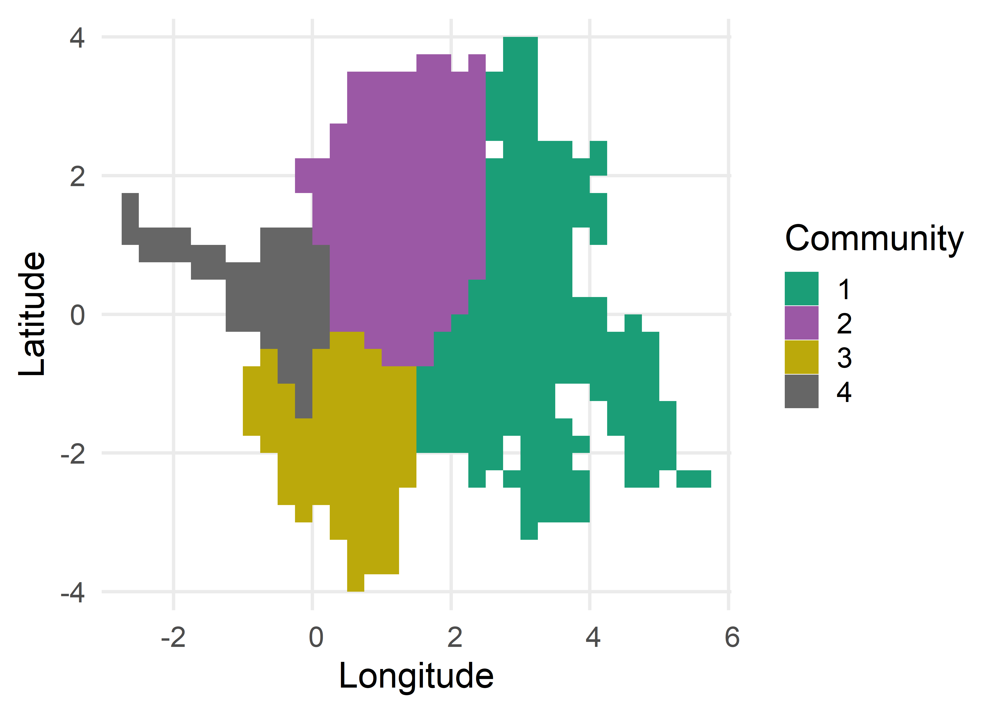

<style>
      img {
      border: 0;
    }
</style>


```{r setup, include=FALSE}
knitr::opts_chunk$set(dpi = 600, 
                      fig.align = 'center', 
                      fig.width = 4, 
                      fig.height = 4,
                      echo = TRUE,
                      collapse = TRUE,
                      comment = "#>") 
```


## Index

1. [Introduction and data preparation](introduction.html)
2. [Movement patterns](movement_patterns.html)
3. [Space-use patterns](space_use_patterns.html)
4. [Intraspecific movements](intraspecific_movements.html)

## *Space-use patterns*

PhysMove includes two metrics for identifying space-use patterns that are based on four functions, including:

  * [Occupancy patterns](space_use_patterns.html#occupancy-patterns): `Occupancy()` and `PlotPDF()`
  * [Community-wide movements](space_use_patterns.html#community-wide-movements): `InfomapCommunities()` and `CommunityMap()`

```{r load physmove space-use vignette, echo=FALSE}
# Load PhysMove
library(PhysMove)
```

## Occupancy patterns

The `Occupancy()` function helps describe species’ space-use patterns by calculating the total number of location estimates within each grid cell and dividing this sum by the grid cell’s area, calculated using spherical coordinates (Figure V13). 

`Occupancy()` requires a data frame with telemetry data (see [data formatting](introduction.html#data-formatting)) and includes three optional parameters:

* `gridCell`: change the grid cell size in degrees (`gridCell=0.25`, by default),
* `map`: present results in a map (`map=TRUE`, by default) and,
* `colGrad`: edit the colours used in the map to indicate low, moderate, and high occupancy, respectively, which are visualised using scale_fill_gradientn() from the ggplot2 package (Wickham 2016) (`colGrad=c(“blue”, “light blue”, “red”)`, by default).

`Occupancy()` outputs a data frame of all results, including:

* *Latitude* and *Longitude*: coordinates for the centre point of each grid cell, 
* *Area*: area of the grid cell,
* *Counts*: the number of location estimates recorded in the grid cell, and 
* *Occupancy*: occupancy values per grid cell (number of counts/area).

```{r calc occ, eval=FALSE, echo=TRUE, message=FALSE}
# Create an occupancy map based on the tracks dataset
Occ <- Occupancy(tracks)
```

**Figure** **V13** Map of occupancy patterns from the `tracks` dataset. Map created with `Occupancy()` default parameters.

```{r aspect ratio, eval=TRUE, echo=FALSE}
# First chunk to fetch the image size and calculate its aspect ratio
img <- magick::image_read("../vignettes/word_formatted/images/occ_map-1.png") # read the image using the magic library
img.asp <- magick::image_info(img)$height / magick::image_info(img)$width # calculate the figures aspect ratio
```

```{r occ_map_load_fig, echo=FALSE, fig.asp=img.asp, out.width="60%"}

```

```{r summarise occ, echo=TRUE, eval=FALSE}
# Summarize occupancy results
summary(Occ) 
```

```{r summary_occ_load_fig, echo=FALSE, fig.align='left', out.width='100%'}

```

### Probability density function of occupancy results

A pdf of the results from `Occupancy()` can be plotted with the `PlotPDF()` function when the `desc` parameter is set to “Occupancy” (Figure V14).

```{r pdf occ, echo=TRUE, eval=FALSE}
# Create a pdf plot of occupancy values
pdf.occ  <- PlotPDF(Occ$Occupancy, desc="Occupancy")
```

```{r aspect ratio2, eval=TRUE, echo=FALSE}
# First chunk to fetch the image size and calculate its aspect ratio
img <- magick::image_read("../vignettes/word_formatted/images/occ_pdf-1.png") # read the image using the magic library
img.asp <- magick::image_info(img)$height / magick::image_info(img)$width # calculate the figures aspect ratio
```

```{r occ_pdf_load_fig, echo=FALSE, fig.asp=img.asp, out.width="60%"}

```

**Figure V14** Probability density function (pdf) plot of occupancy values for the tracks dataset calculated with `Occupancy()` default parameters. Plot created using `PlotPDF()` with `desc=“Occupancy”`.

$~$
$~$

[Back to top](space_use_patterns.html)

## Community-wide movements 

Interactions between species’ movements and their space-use can be described using a network analysis algorithm called Infomap, which identifies communities where animals follow similar movement patterns and remain for extended periods. To identify Infomap communities, PhysMove requires the `infomapecology` R package [linked here](https://github.com/Ecological-Complexity-Lab/infomap_ecology_package) and a stand-alone Infomap file (*Infomap.exe*) [linked here](https://ecological-complexity-lab.github.io/infomap_ecology_package/installation). Installation instructions and further details about Infomap can be found at: <https://ecological-complexity-lab.github.io/infomap_ecology_package/installation> and Farage *et* *al*. (2021). The following instructions assume both the `infomapecology` R package and the stand-alone Infomap file have been installed.

The `InfomapCommunities()` function identifies community-wide movements in two steps. First, `InfomapCommunities()` calculates the probability of individuals moving between specific grid cells along their track within a predetermined time window. This step creates a transition probability matrix (tpm), which can also be referred to as a “unipartite edge list”.  Next, `InfomapCommunities()`  feeds the transition probability matrix into a function from the `infomapecology` package to create an *Infomap monolayer object* that identifies movement communities. 

To ensure the `infomapecology` algorithm calculates movement patterns consistent with telemetry data, we assign parameters to the infomapecology function that allow for directed movement, self-links (i.e., individuals can remain in the same grid cell over time), and hierarchical partitioning (i.e., the resulting communities are composed of multiple levels). Because we allowed hierarchical partitioning, the resulting communities are associated with different levels. Level 1 communities are the most inclusive and have been used to identify community-wide movements (following Rodríguez *et* *al*. 2017 and Calich *et* *al*. 2021). 

The `InfomapCommunities()` function requires a data frame with telemetry data (see [data formatting](introduction.html#data-formatting)) and includes five optional parameters:

* `gridCell`: change the grid cell size in degrees (`gridCell=0.25`, by default),
* `hours`: number of hours between location estimates (`hours=24`, by default), 
* `range_hr`: time range in hours (`range_hr=6`, by default). This parameter allows you to identify location estimates that are close to, but not exactly separated by the set number of `hours`, and 
* `tpm`: save the transition probability matrix to the output list as a second list element(`tpm=FALSE`, by default).

`InfomapCommunities()` outputs a list with up to two list objects. The first list object is an *infomap monolayer object* that summarizes the hierarchical structure of the Infomap communities (regions where individuals follow similar movement patterns and are likely to stay for longer periods of time). The second list object is the transition probability matrix, which is only output if `tpm=TRUE`.

**Important**: Before running `InfomapCommunities()` you must set your working directory to the folder that contains the stand-alone Infomap file (*Infomap.exe*). 

```{r load infomap, eval=FALSE, message=FALSE, warning=FALSE}
# Identify community-wide movements 
setwd("~/2023/PhysMove") # Update your working directory to the folder containing the infomap file
library(infomapecology) 
infomapResult <- InfomapCommunities(tracks)
```

```{r structure of infomap, echo=TRUE, eval=FALSE}
# View the Infomap monolayer object structure
str(infomapResult[["infomap_object"]])
```

```{r infomap_str_load_fig, echo=FALSE, fig.align='left', out.width='100%'}

```

### Plot Infomap communities

`CommunityMap()` visualises results from `InfomapCommunities()` by converting the *Infomap monolayer object* into a map (Figure V15).

The `CommunityMap()` function requires the *Infomap monolayer object* output from `InfomapCommunities()` and includes two optional parameters:

* `subset_communities`: used to only map specific level 1 communities. For example, `subset_communities = c(1,2,3)` would plot the first three level 1 communities, and
* `colours`: change colours of the communities (`colours= “Dark2”`, by default).

```{r infomap map, echo=TRUE, message=FALSE, eval=FALSE}
# Create a map of the Infomap communities
CommunityMap(infomapResult)
```

```{r aspect ratio3, eval=TRUE, echo=FALSE}
# First chunk to fetch the image size and calculate its aspect ratio
img <- magick::image_read("../vignettes/word_formatted/images/infomap_map-1.png") # read the image using the magic library
img.asp <- magick::image_info(img)$height / magick::image_info(img)$width # calculate the figures aspect ratio
```

```{r incomap_map_load_fig, echo=FALSE, fig.asp=img.asp, out.width="60%"}

```

**Figure** **v15** Map illustrating level 1 Infomap communities from the `tracks` dataset determined using `InfomapCommunities()` default parameters. Map created with `CommunityMap()` default parameters.

$~$
$~$

[Proceed to Intraspecific Movements](intraspecific_movements.html)

[Back to top](space_use_patterns.html)

$~$
$~$

## References & Recommended resources

<div style="text-indent: -40px; padding-left: 40px;">

Burnham, K.P. & Anderson, D.R. (2004) Multimodel Inference: Understanding
  AIC and BIC in Model Selection. *Sociological Methods & Research*, 33,
  261-304.

Calich, H.J. *et al*. (2021) Comprehensive analytical approaches reveal
  species-specific search strategies in sympatric apex predatory sharks.
  *Ecography*, 44, 1544-1556.

Farage, C. *et al*. (2021) Identifying flow modules in ecological
  networks using Infomap. *Methods in Ecology and Evolution*, 12, 778–786.

Méndez, V., *et al*. (2013). Stochastic Foundations in Movement Ecology:
  Anomalous Diffusion, Front Propagation and Random Searches. Berlin,
  Heidelberg, Germany, Springer Berlin / Heidelberg.

Rodríguez, J.P. *et al*. (2017) Big data analyses reveal patterns and
  drivers of the movements of southern elephant seals. *Scientific*
  *Reports*, 7, 1-10.

Viswanathan, G. M., *et al*. (2011). The Physics of Foraging: An
  Introduction to Biological Encounters and Random Searches. Cambridge,
  Cambridge University Press.

Wickham, H. (2016) ggplot2: Elegant Graphics for Data Analysis.
  Springer-Verlag, New York.

</div>
